## Disclaimer

This presentation reflects the views of the authors and should not be construed to represent the views or policies of the NIH 

---

## A world in binary

We often simplify our world, avoiding the grey

+ No - Yes
+ Sick - Healthy
+ Normal tissue - Diseased tissue
+ Bad - Good

and want to associate this binary view of an outcome with other predictors we might be measuring

In other words, we're interested in the relationship between a binary outcome _Y_ and a set of predictors _X_, denoting this by $Y|X$

*** pnotes

Focus on binary outcomes

--- 


## A world in binary

We have been made to believe that 

<p style="font-size:40px; text-align:center">Binary outcomes = classification</p>

and so find many algorithms for binary outcomes restricted to the _classification problem_

--- 

## A world in binary

We have been made to believe that 

<p style="font-size:40px; text-align:center">Binary outcomes = classification</p>

and so find many algorithms for binary outcomes restricted to the _classification problem_

However, the fact of the matter is that, as long as we believe
E(Y|X) = P(Y=1|X) = p is continuous, we can do

<p style="font-size:40px;color:red;text-align:center"> regression </p>


--- .segue .dark

## Binary regression

---

## Binary regression

We're already familiar with binary regression in one form
<p style="font-size:30px;text-align:center;color:red">logistic regression</p>

---

## Binary regression

We're already familiar with binary regression in one form
<p style="font-size:30px;text-align:center;color:red">logistic regression</p>
In fact, if you recall, we write
$$ \log(\frac{p}{1-p}) = \beta_0+\beta_1X_1+\beta_2X_2 $$

---

## Binary regression

We're already familiar with binary regression in one form
<p style="font-size:30px;text-align:center;color:red">logistic regression</p>
In fact, if you recall, we write
$$ \log(\frac{p}{1-p}) = \beta_0+\beta_1X_1+\beta_2X_2 $$

We then promptly dichotomize our predictions into 0-1 and look at misclassification rates

---

## Binary regression

We're already familiar with binary regression in one form
<p style="font-size:30px;text-align:center;color:red">logistic regression</p>
In fact, if you recall, we write
$$ \log(\frac{p}{1-p}) = \beta_0+\beta_1X_1+\beta_2X_2 $$

We then promptly dichotomize our predictions into 0-1 and look at misclassification rates

<p style="font-size:100px;text-align:center">WHY!!!</p>


--- .segue .dark

## Probability machines

---

## Probability machines

Probability machines are learning machines for binary outcomes which are 

+ non-parametric
+ consistent

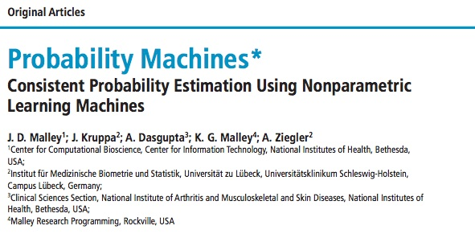

---

## Probability machines

Probability machines are learning machines for binary outcomes which are 

+ non-parametric
+ consistent

Several candiates exist for probability machines

+ Random Forests regression
+ k-nearest neighbors regression
+ Some support vector machines
+ Potentially many others


---

## Probability machines

Probability machines are learning machines for binary outcomes which are 

+ non-parametric
+ consistent

Several candiates exist for probability machines

+ <span style="color:blue">**Random Forests regression (RFPM)**</span>
+ k-nearest neighbors regression
+ Some support vector machines
+ Potentially many others

Biau and colleagues proved several consistency results for both RF and kNN 

--- 

## Probability machines

A PM has several advantages over classical regression methods

> + There is no need to assume a particular data generating model
> + There is no need to specify a functional form for the relationship between the outcome and predictors

>   + Interactions
>   + Transformations of variables
>   + Link functions (logit, probit, tobit, ...)

> + There is no restriction on dimensionality of the predictors
> + Algorithms are often parallelizable 

--- &twocol

## Probability machines

Let's compare probability machines to logistic regression, the industry standard

  Logistic regression                   | Probability machines
  ------------------------------------- | -----------------------------
  Assumes data from logistic regression | No such assumption
  Explicit functional form              | No such specification
  Need to specify interactions          | Interactions implicit
  Predictors less than observations     | Scalable to higher dimensions
  
<br>
Some will argue that logistic regression is important to understand the 
<span style="color:black;font-weight:bold;text-decoration:underline">effect</span> of predictors. 

This is coming up soon!

For now, let's look at prediction

--- .segue .dark

## Predictive ability

---

## Simulations

We generate data from a *logistic regression* model with 

+ 10 independent binary features
+ 3 features associated with outcome to various degrees
+ 7 features not associated with outcome (to mimic sparseness)

---

## Simulations

We fit three models to the generated data

+ Main effects logistic regression <br>
``` glm(y~x1+x2+x3+..., family=binomial) ```

+ Main effects + two-way interactions logistic regression <br>
``` glm(y~(x1+x2+x3+...)^2, family=binomial) ```

+ Random forest regression <br>
``` randomForest(y~x1+x2+x3+...) ```

For this entire exercise, <span style="font-weight:bold">we do not change this code</span>

---

## Simulations

Start with data from a main effects model (ORs of 1.2, 1.7, 2.5)

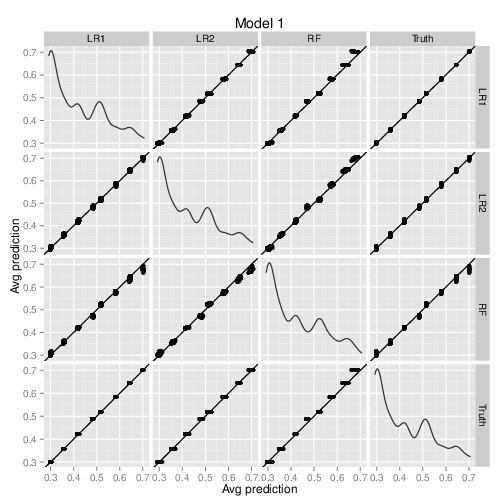

<p style="clear:both;"></p>

LR1 = main effects logistic regression<br>
LR2 = main effects+interaction logistic regression<br>
RF = random forest probability machine

---

## Simulations

Now add interactions (X1 x X2 = 2, X2 x X3 = 5)

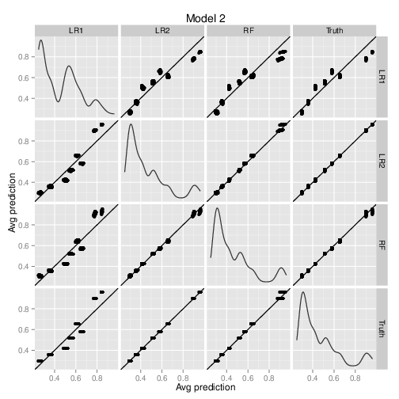
<<p style="clear:both;"></p>

LR1 = main effects logistic regression<br>
LR2 = main effects+interaction logistic regression<br>
RF = random forest probability machine

---

## Simulations

Now add interactions (X1 x X2 = 2, X2 x X3 = 5)

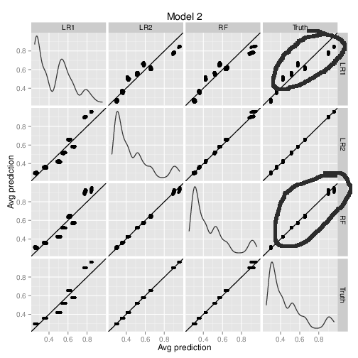
<<p style="clear:both;"></p>

LR1 = main effects logistic regression<br>
LR2 = main effects+interaction logistic regression<br>
RF = random forest probability machine

---

## Simulation

Now let's look at arbitrary probabilities for each (X1,X2,X3) combination

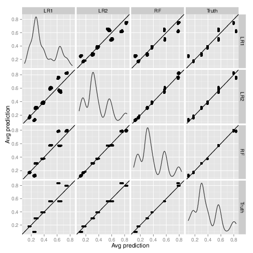
<p style="clear:both;"></p>

LR1 = main effects logistic regression<br>
LR2 = main effects+interaction logistic regression<br>
RF = random forest probability machine

---

## Simulation

Now let's look at arbitrary probabilities for each (X1,X2,X3) combination

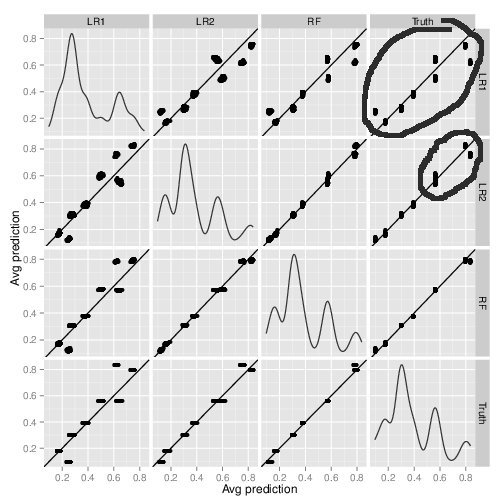

<p style="clear:both;"></p>

LR1 = main effects logistic regression<br>
LR2 = main effects+interaction logistic regression<br>
RF = random forest probability machine

---

## Conclusions

> 1. If the logistic model is mis-specified, it does poorly. **RFPM doesn't**
> 2. We don't have to change the code for RFPM to do well for different generating models
> 3. RFPM captures different aspects of the data auto-magically. With logistic regression, if you're not correct in your specification, you can screw up.
> 4. Main effects data is rather rare, but we fit main effects logistic regression as the default. Fit RFPM instead, CYA, and (preview) see what kinds of models might be reasonable 

--- bg:url(figure/img_6940.jpg)

<h2 style="color:yellow">Can we NOT use logistic regression to get effect sizes?</h3>

---.segue .dark

## Risk Estimation

--- bg:url(figure/gates-blog.jpg)

---

## Effect size

Let's go back to your first regression course

<blockquote style="color:#66a;font-size:30px;font-weight:bold;font-style:italic;margin:1em 3em;">
"How much does the outcome change, on average, when a predictor changes
by one unit, all other predictors remaining the same?"
</blockquote>

---

## Effect size

Let's go back to your first regression course

<blockquote style="color:#66a;font-size:30px;font-weight:bold;font-style:italic;margin:1em 3em;">
"How much does the outcome change, on average, when a predictor changes
by one unit, all other predictors remaining the same?"
</blockquote>

This is based on the concept of <span style="font-style:italic;text-decoration:underline;">counterfactuals</span>

> + What would happen <span style="font-weight:bold">if</span> a predictor changed by 1 unit keeping everything else the same?
> + This is not something we can observe, but only something we can conceptualize
> + Using multiple machines, we can actually estimate these counterfactuals directly <span style="font-weight:bold">for each observation!!!</span>
> + We don't need parameters in the model; we can do this nonparametrically
> + Requires us to think about what exactly are the effects we want to interrogate

---

## Counterfactuals

<table border="0">
<tr>
<td align=center> X = 1 </td><td align="center"> X = 0 </td>
</tr>
<tr>
<td></td>
<td> </td>
</tr>
</table>


The counterfactual argument is, in essence

<p style="text-align:center"> If we put an observation in the other landscape, what would it do? </p>

--- 

## Counterfactual machine

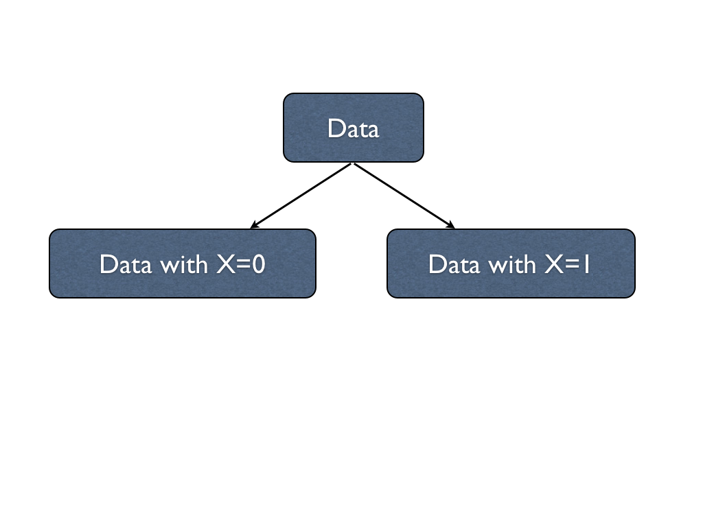

--- 

## Counterfactual machine

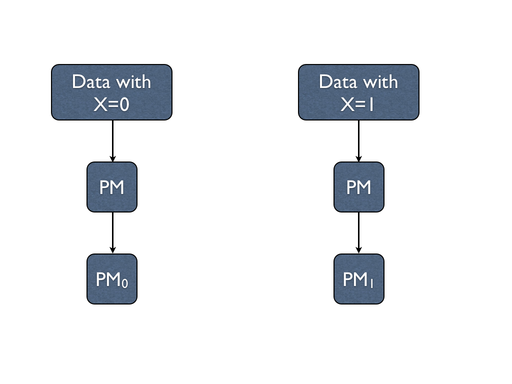


--- 

## Counterfactual machine

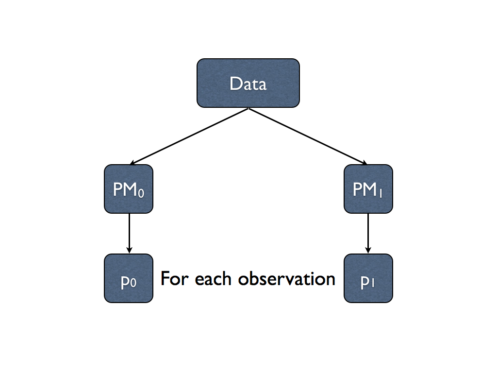


---

## Risk machine

+ PM$_1$ captures the landscape for X=1
+ PM$_0$ captures the landscape for X=0

Now put each observation in each landscape and record its predicted outcome

Note, for each observation we now have a $p_1$ and a $p_0$

Now we can compute <span style="color:blue;font-style:italic"> conditional odds ratios </span> using
$$ OR = \frac{p_1(1-p_0)}{(1-p_1)p_0}$$
for each observation, and look at group-specific odds ratios by averaging or taking medians

<p style="text-align:right;font-style:italic;font-size:75%;">Counterfactual and risk machines and applications developed by Jim Malley and Abhijit Dasgupta,<br> in collaboration with Joan Bailey-Wilson, Jason Moore and Silke Szymczak<br>
Paper under final review at BioData Mining
</p>

---
## Simulations

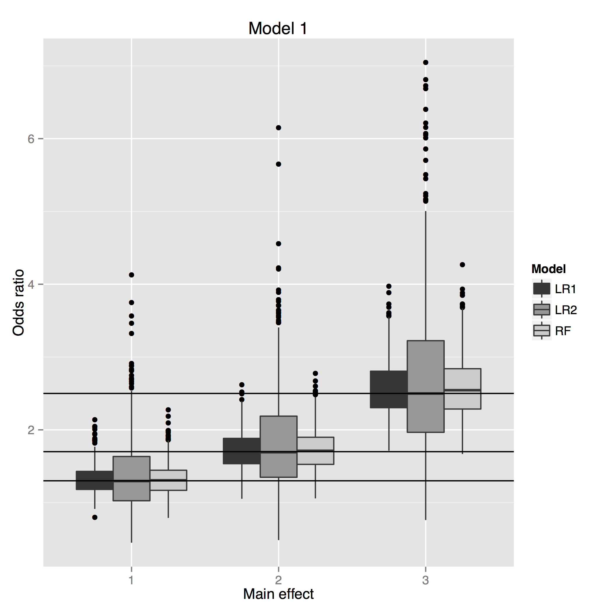

Look at a main effects model

+ All 3 are unbiased
+ RF does as well as logistic regression for efficiency

---

## Risk machine

We have individual $p_1$ and $p_0$, so we can directly compute 

+ risk differences $$ RD = p_1 - p_0 $$
+ risk ratios $$ RR = p_1/p_0 $$

---

## Risk machine

### What about interactions?

Since we have a way of estimating counterfactuals, estimating conditional interaction effects are straightforward

Make 4 machines to "capture landscapes" when

+ X1 = 0, X2 = 0 ($\rightarrow p_{00}$)
+ X1 = 1, X2 = 0 ($\rightarrow p_{10}$)
+ X1 = 0, X2 = 1 ($\rightarrow p_{01}$)
+ X1 = 1, X2 = 1 ($\rightarrow p_{11}$)

Now compute the appropriate contrast ($p_{11} - p_{10} - p_{01} + p_{00}$) or ratio 
$$\frac{p_{11}(1-p_{10})}{p_{10}(1-p_{11})}/\frac{p_{01}(1-p_{00})}{p_{00}(1-p_{01})}$$

---

## Risk machine

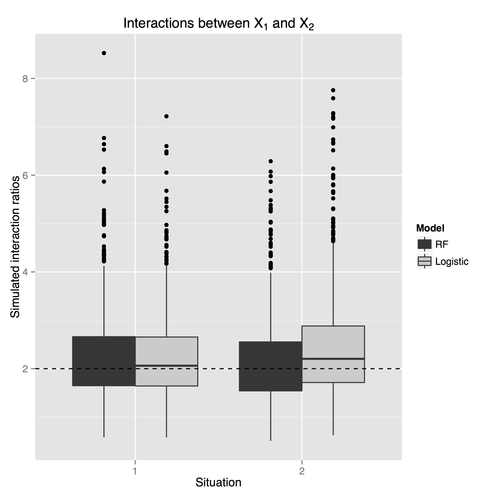
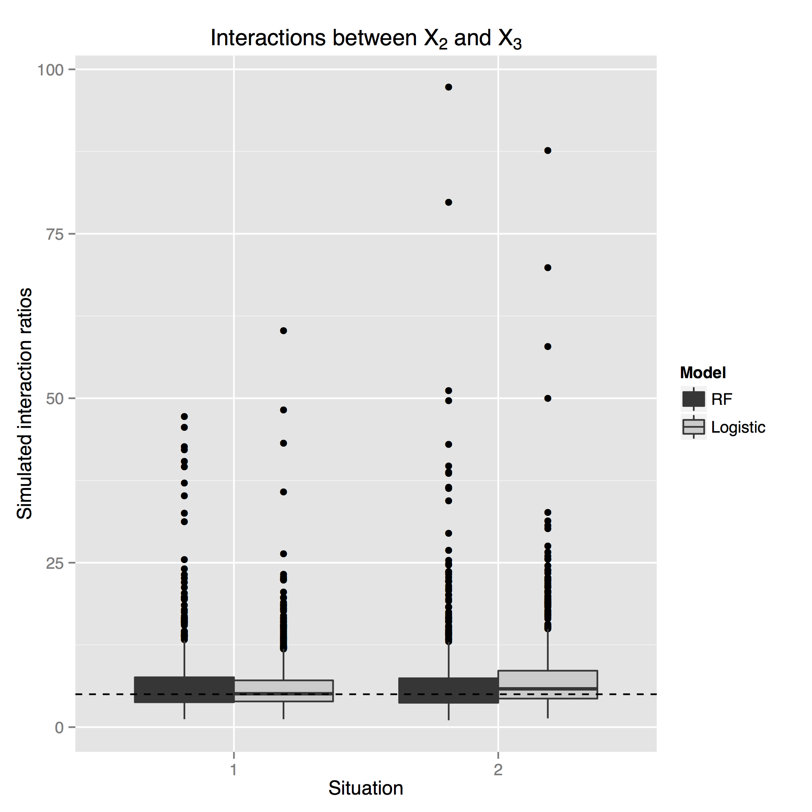
<p style="clear:both;"></p>


---

## More about interactions

The Risk Machine$^{TM}$ is cumbersome when you have many features.

We can actually do a faster scan of the data to find 2-way interactions

We call it the <span style="color:blue;font-weight:bold">Interactor$^{TM}$</span>

---

## The Interactor

We fit one PM to the data and get predicted probabilities

+ Average probabilities over X1=1, X2=1 $\rightarrow P_{11}$
+ Average probabilities over X1=0, X2=1 $\rightarrow P_{01}$
+ Average probabilities over X1=1, X2=0 $\rightarrow P_{10}$
+ Average probabilities over X1=0, X2=0 $\rightarrow P_{00}$

We can now create classical interaction plots either on natural or logit scale

---

## The Interactor

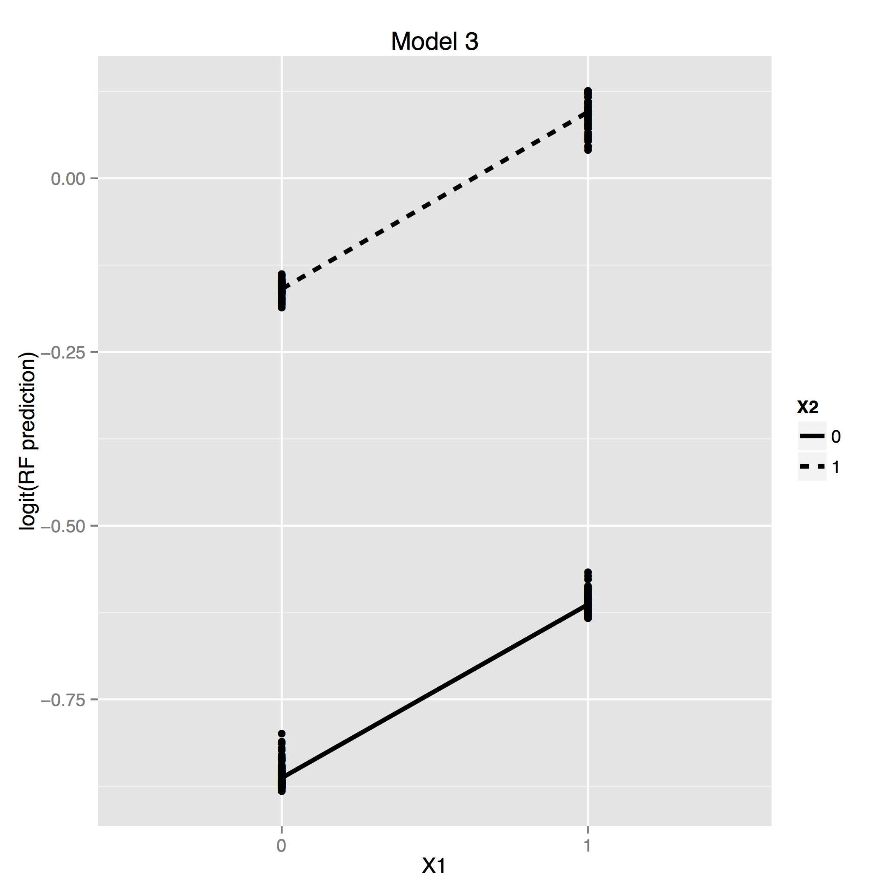
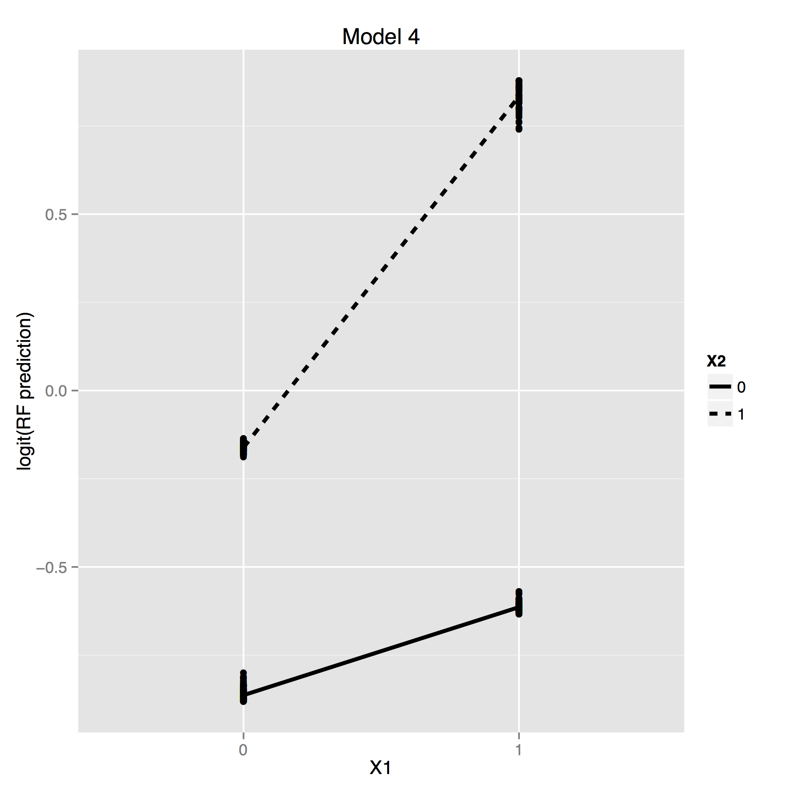
<p style="clear:both;"></p>

---

## The Interactor

### How about when we need to scan an entire genome?

1. Run 1 PM on the dataset
2. Compute interaction contrasts for each pair of features 
3. Create an interaction heatmap to find interaction hotspots
4. Drill down (MDS, more analyses)

---
## Bottom line

> + A common complaint of machines is that they are not interpretable
+ This work gets around the "black box" nature of machines to provide useful estimates of interest to the biomedical community
+ These do not make any structural assumptions, so they can be used to aid model development if parametric models are desired.
+ Research is ongoing to provide risk estimates for continuous predictors


--- bg:url(figure/Ratu-Boko-Yogya.jpg)

---
## The post-parameter ecosystem

> + The framework we have created around the concept of probability machines has led to several developments and extensions by collaborators that allow different problems to be addressed directly
> + We are creating a new ecosystem in which parametric specification of relationships in a regression setting is unnecessary and, in fact, redundant

---
## The post-parameter ecosystem

### The new nomenclature

+ Machines

  + Probability machine
  + Counterfactual machine
  + Risk machine
  
+ Interactor

---
## The post-parameter ecosystem

### The new nomenclature

+ Understanding regression structures using machines
+ Recurrency and probabilistic feature ranking
+ Recurrency and filtering
+ Entanglement maps
+ Machine collectives
+ Misclassification uncertainty
+ Feature content
+ Synthetic features
+ Regression collectives
+ Profiling and strategic decisions using machines and simulation

--- .segue .dark

## Some example applications 

---

## Propensity scoring

Propensity scores quantify the likelihood that individuals receive a treatment given other covariates

It is used often in observational studies to "level the playing field"

We have successfully used probability machines to generate propensity scores instead of logistic regression. It accounts for non-linearities in relationships better than logistic regression 

<p style="text-align:right;font-style:italic;font-size:75%">
Methods developed by Abhijit Dasgupta<br>Wasko, Dasgupta, Hubert, Fries, Ward (2013) Arthritis & Rheumatism </p>

---
## Scanning the genome

### Transcription start sites in Drosophila

+ Transcription start sites based on tetrameric structure of genome
+ Scan the genomic tetramers using probability machines
  + Learn from known data
  + Provide probability estimates for start sites for entire genome
+ A new algorithm for finding the most predictive nodes in a tree/forest (__feature content__)
+ Scanning Drosophila genome (155M) produced <10% error rate and recaptured known tetramers at true start sites (several 1000s; several tissue types; two species)

<p style="text-align:right;font-style:italic;font-size:75%">
Work primarily by Anthony Fletcher and Jim Malley<br>Collaborative paper under review in Genome Research </p>


---

## Understanding regression structures

The basic idea

+ Run probability machines as a first pass at the data
+ The nonparametric nature of PM allows agnostic capture of the patterns in the data
+ Graphically look at marginal patterns, interactions, other interesting ideas
+ Use as a check on data quality
+ Use this as a discovery tool for further modeling and analysis

<p style="text-align:right;font-style:italic;font-size:75%">
Ongoing consulting by Abhijit Dasgupta with various collaborators
</p>

---
## Understanding regression structures

### Childhood obesity and eating patterns (Yanovski, NICHD)

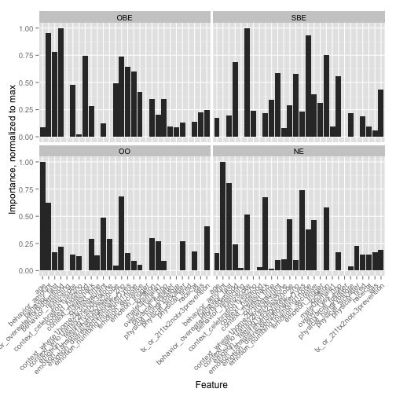

---

## Understanding regression structures

### Childhood obesity and eating patterns (Yanovski, NICHD)

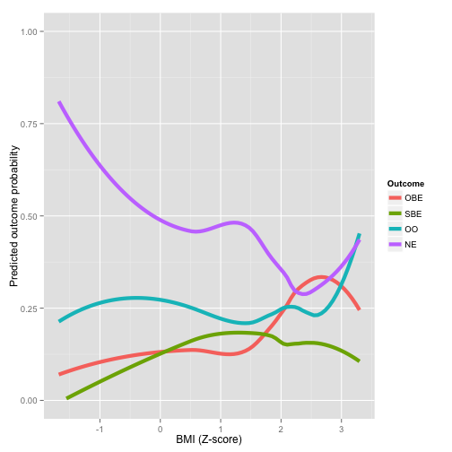

---
## Entanglement maps

The basic idea

+ Context is large multivariate data collected on individuals (SNPs, pixels from images)
+ Predict each variable using the rest using a learning machine and compute importance scores
+ The importance score is a "metric" of the predictive strength of one variable on another in the context of the other variables

  + It accounts for the landscape
  
+ We want to capture which pairs of variables have a strong dependency on each other in a predictive sense
+ The dependency need not be symmetric, though we have implemented a symmetrized version

<p style="text-align:right;font-style:italic;font-size:75%">
Dede Greenstein (NIMH) and Abhijit Dasgupta
</p>

---


## Entanglement maps

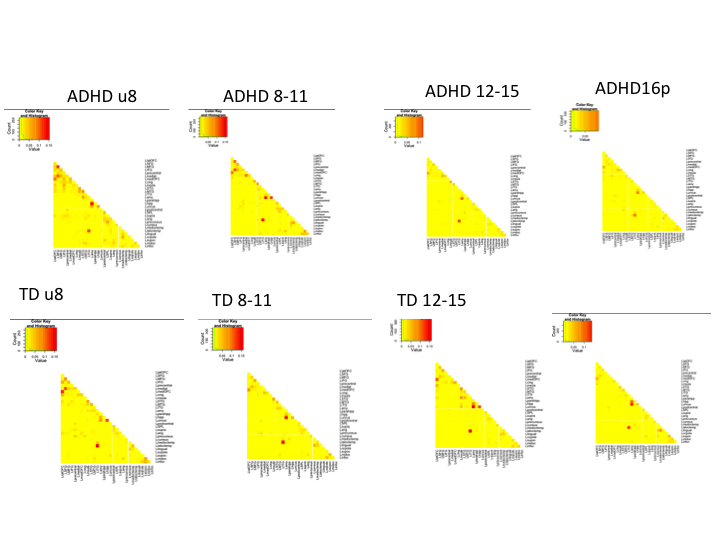

---
## Synthetic features

The basic idea

+ There is biological information about the functional relationship between groups of genes/proteins (networks)
+ We can create small learning machines using just these networks
+ We can then use these network machines as inputs (_synthetic features_) in a larger machine that looks at the overall landscape in predicting outcome

<p style="text-align:right;font-style:italic;font-size:75%;">
Qinxin Pan and Jason Moore (Dartmouth) and Jim Malley<br>
Paper under review at Genetic Epidemiology
</p>

---
## Probability collectives (COBRA)

The basic idea

+ Mojirsheibani (1999) proposed the idea of combining classifiers such that the collective provably does better than any individual machine in the collective

  + Note that this is <span style="font-weight:bold">not</span> an ensemble method
  
+ The Paris group, inspired by Jim, has extended this to collectives of regression machines

  + Non-trivial mathematics involved
  + Leverages work of GKKW as well as DGL
  
+ R package forthcoming in Q1

<p style="text-align:right;font-style:italic;font-size:75%;">
Aurelie Fischer, Benjamin Guedj, Gerard Biau (Paris) inspired by Jim Malley<br>
Paper under review at JRSS-B
</p>

---
## COBRA

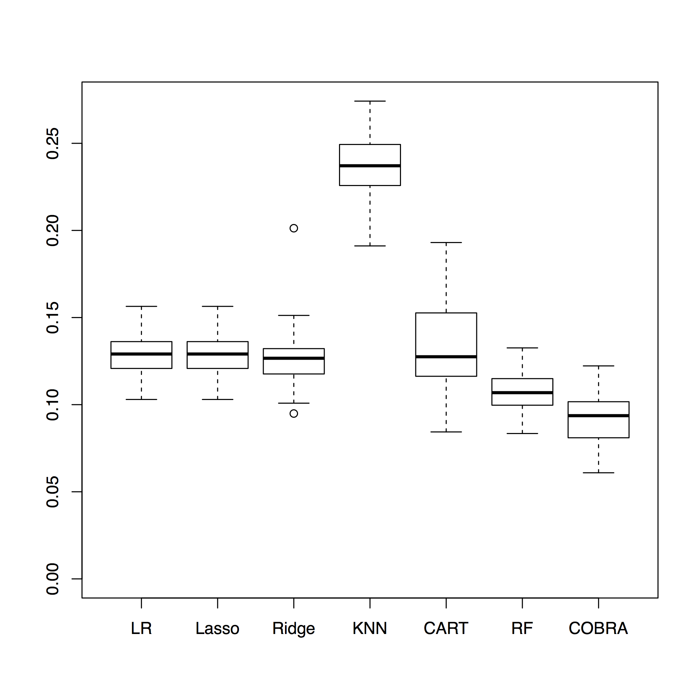

---
## Profiling and strategic decisions using machines and simulation

The basic idea

+ Use machines to predict risk of an event based on a large feature set and current/historical data
+ "Tweak" the data (univariately and multivariately) and create synthetic data which is fed through the trained machine(s) to provide updated predicted risks
+ Develop profiles for the effects of feature changes to help make strategic decisions

<p style="text-align:right;font-style:italic;font-size:75%">
Ongoing enterprise consulting and product development by Abhijit Dasgupta
</p>

--- .segue .dark

## Ongoing portfolio

---
## What we're working on

+ Probability and risk machines for 
  + continuous features
  + case-control studies
  + clustered data
  + survival studies
+ Competing risks for survival studies using synthetic features
+ Improved methods for decision engines using machines

---
## Acknowledgements

+ Joan Bailey-Wilson (NHGRI)
+ Jason Moore (Dartmouth)
+ Silke Szymczak (Kiel, Germany)
+ Gerard Biau (Paris)
+ Brian Oliver (NIDDK)
+ Larry Brody (NHGRI)
+ Dede Greenstein (NIMH)
+ Michael Ward (NIAMS)

---.segue .dark

## Thank you for your attention

---
